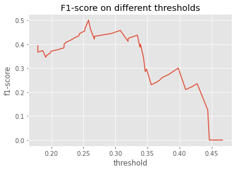

# FDA  Submission

**Your Name:** Aarya Patel

**Name of your Device:** PneumoniaNet

## Algorithm Description 

### 1. General Information

**Intended Use Statement:** Assisting a radiologist in classifying a given chest x-ray for the presence or absence of pneumonia.

**Indications for Use:** Indicated for use in screening Pneumonia in males and females of ages 1-95 years having one or more combination of following diseases: atelectasis, heart enlargement, standardization, edema, effusion, emphysema, fibrosis, hernia, infiltration, mass, Creed, pleura thickening and pneumothorax.

**Device Limitations:** 
* Requires Nvidia GPU for fast workflow reprioritization. Otherwise could face latency issues.
* The image intensity distribution of pneumonia like very similar to that of Infiltration and effusion which can confuse our model and lead to false results.

**Clinical Impact of Performance:**
The algorithm is designed to have high recall. When a high recall test returns a negative result, we can be confident that the result is truly negative since a high recall test has low false negatives. This is specially useful in worklist prioritization where we want to make sure that people without the disease are being de-prioritized.


### 2. Algorithm Design and Function


**DICOM Checking Steps:**
The DICOM metadata is checked for following:

* Modality = DX
* Body Part Examined = Chest
* Patient Position in `[PA, AP]`

**Preprocessing Steps:**
All the images have been normalized in range of [0, 1] using Standardization and then the images are resized to (512, 512, 3).

**CNN Architecture:**
We have used a pre-trained VGG-16 network with fine tuning done on the last convolution layer.
The architecture details are as follows:

```
_________________________________________________________________
Layer (type)                 Output Shape              Param #   
=================================================================
vgg16 (Model)                (None, 16, 16, 512)       14714688  
_________________________________________________________________
global_average_pooling2d_2 ( (None, 512)               0         
_________________________________________________________________
dense_5 (Dense)              (None, 256)               131328    
_________________________________________________________________
batch_normalization_4 (Batch (None, 256)               1024      
_________________________________________________________________
dropout_4 (Dropout)          (None, 256)               0         
_________________________________________________________________
dense_6 (Dense)              (None, 64)                16448     
_________________________________________________________________
batch_normalization_5 (Batch (None, 64)                256       
_________________________________________________________________
dropout_5 (Dropout)          (None, 64)                0         
_________________________________________________________________
dense_7 (Dense)              (None, 32)                2080      
_________________________________________________________________
batch_normalization_6 (Batch (None, 32)                128       
_________________________________________________________________
dropout_6 (Dropout)          (None, 32)                0         
_________________________________________________________________
dense_8 (Dense)              (None, 1)                 33        
=================================================================
Total params: 14,865,985
Trainable params: 2,510,401
Non-trainable params: 12,355,584

```

### 3. Algorithm Training

**Parameters:**
* Types of augmentation used during training:
  * Horizontal Flip
  * Random Rotation upto 20 degrees
  * Random shear range of (+/-) 15%
  * Random width shift of (+/-) 10%
  * Random height shift of (+/-) 10%
  * Random zoom range of (+/-) 12%
* Batch size: 32
* Optimizer learning rate: 3e-3
* Layers of pre-existing architecture that were frozen: First 17 layers of VGG pre-trained network
* Layers of pre-existing architecture that were fine-tuned: Last convolutional layer and all fully-connected layers of the architecture.


**Final Threshold and Explanation:**



The final threshold is chosen based on f1_score vs threshold curve. The threshold value that gives the maximum f1-score is chosen. It's 0.26 in our case.

### 4. Databases

Chest X-ray exams are one of the most frequent and cost-effective medical imaging examinations available. However, clinical diagnosis of a chest X-ray can be challenging and sometimes more difficult than diagnosis via chest CT imaging. The lack of large publicly available datasets with annotations means it is still very difficult, if not impossible, to achieve clinically relevant computer-aided detection and diagnosis (CAD) in real world medical sites with chest X-rays.

This NIH Chest X-ray Dataset is comprised of 112,120 X-ray images with disease labels from 30,805 unique patients. 
The CSV file has following columns:

* Image Index: File name
* Finding Labels: Disease type (Class label)
* Follow-up #
* Patient ID
* Patient Age
* Patient Gender
* View Position: X-ray orientation
* OriginalImageWidth
* OriginalImageHeight
* OriginalImagePixelSpacing_x
* OriginalImagePixelSpacing_y


**Description of Training Dataset:** 
The training data has 2290 chest-xray images. These are evenly distributed to have 50% pneumonia cases and 50% non-pneumonia cases.


**Description of Validation Dataset:** 
The training data has 1430 chest-xray images. These are  distributed to have 20% pneumonia cases and 80% non-pneumonia cases to be a representation of real-world scenario.


### 5. Ground Truth

To create these ground thruth, the authors used Natural Language Processing to text-mine disease classifications from the associated radiological reports. The labels are expected to be >90% accurate and suitable for weakly-supervised learning.

### 6. FDA Validation Plan

**Patient Population Description for FDA Validation Dataset:**
The FDA Validation Dataset contains patients(both male and female) in age-range of 1-95 years. It includes 20% pneumonia cases and 80% non-pneumonia cases. Further each patient have multiple follow-ups.

**Ground Truth Acquisition Methodology:**
The image labels are NLP extracted so there could be some erroneous labels but the NLP labeling accuracy is estimated to be >90%.

**Algorithm Performance Standard:** The algorithm performance has been validated using F1-score. The F1 score combines both precision and recall. F1 score allows us to better measure a test’s accuracy when there are class imbalances. We got an F1-score of 0.5 which is better than radiologist average F1-score of 0.387.

-----

## Acknowledgement

This project has been completed as a part of [AI for Healthcare](https://www.udacity.com/course/ai-for-healthcare-nanodegree--nd320).

## License

This project is licensed under the terms of MIT License.

